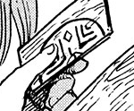

# Spell of Reduction

_Source: [https://witchhatatelier.telepedia.net/wiki/Spell_of_Reduction](https://witchhatatelier.telepedia.net/wiki/Spell_of_Reduction)_
_Category: Time Spells_

| Field       | Value        |
| ----------- | ------------ |
| Type        | Spell        |
| User(s)     | Witches      |
| Manga Debut | Chapter 45.5 |

The **spell of reduction** is a time [spell](/wiki/Spells 'Spells') that causes items to shrink down far below their typical size.

## Description

The spell contains a sigil that appears to be a central repetition sign (it is hard to tell as the spell is bisected) surrounded inverted expansion signs, with 4 diamond signs in the gaps between them. This spell works by shrinking anything within it's area of effect, just like the [floating expansion](/wiki/Floating_Expansion 'Floating Expansion') spell, which operates on the same concept as this one, with the expansion signs in their normal state rather than inverted, leading to growth instead of reduction in regards to size.

## Usage

The spell is seen used in the [period piece](/wiki/Period_Pieces 'Period Pieces') contraption, a contraption used to store clothes from bygone eras. The contraption composes of a tiny box, with the sigil on it's lid and bottom. At one point, [Qifrey](/wiki/Qifrey 'Qifrey'), [his aprentices](/wiki/Qifrey%27s_Atelier "Qifrey's Atelier"), and [Olruggio](/wiki/Olruggio 'Olruggio') were going through the contents of several of the contraptions to look for outfits to wear for [Silver Eve](/wiki/Silver_Eve 'Silver Eve').

## References

1. Witch Hat Atelier Manga: Chapter 45.5 , Page 3
2. Witch Hat Atelier Manga: Chapter 45.5
