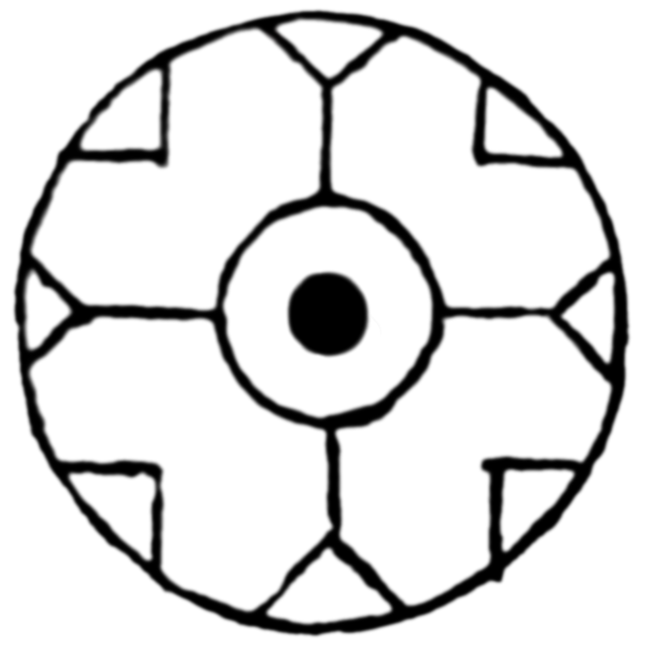
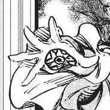
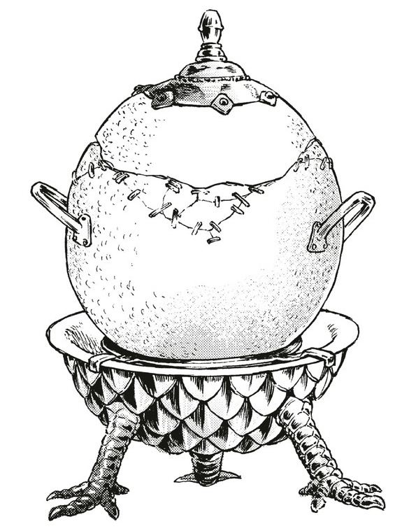

# Time Stop

_Source: [https://witchhatatelier.telepedia.net/wiki/Time_Stop](https://witchhatatelier.telepedia.net/wiki/Time_Stop)_
_Category: Time Spells_

| Field       | Value                      |
| ----------- | -------------------------- |
| Type        | Spell                      |
| Creator     | Unknown                    |
| User(s)     | Witches                    |
| Manga Debut | Chapter 45                 |
| Anime Debut | Episode 1 in Petrification |

**Time Stop**[*unofficial name*] is a time-type [spell](/wiki/Spells 'Spells') that freezes time for anything it is targeting.

## Description

Time stop uses a number of geometric-like unknown signs, similar to [Counterclock](/wiki/Counterclock 'Counterclock'), but includes a central dot like how the [repetition sigil](/wiki/Sigils_Explained#Repetition 'Sigils Explained') does. Time stop will freeze the motion of anything it is targeting, as if time were stopped for that thing. Like most spells, unless otherwise specified by a sign such as [region](/wiki/Signs_Explained#Region 'Signs Explained') time stop will only freeze things within the bounds of its ring. The central dot can be replaced with a [Sigil](/wiki/Sigils_Explained 'Sigils Explained') to target a specific thing, like seen in the [Warmth-Retention Seal](/wiki/Warmth-Retention_Seal 'Warmth-Retention Seal').

## Usage

**SPOILER WARNING**  
_This section contains spoilers for [Chapter 45](/wiki/Chapter_45 'Chapter 45')._

It is assumed that after [Dagda](/wiki/Dagda 'Dagda') and [Custas](/wiki/Custas 'Custas') were ambushed, [Ininia](/wiki/Ininia 'Ininia') uses her [gloves](/wiki/Ininia%27s_Gloves "Ininia's Gloves"), which feature time stop seals drawn on the palms, to stop [Dagda](/wiki/Dagda 'Dagda') from continuing to bleed out, before eventually making use of the [Counterclock seal](/wiki/Counterclock 'Counterclock') to revert his injuries.

Palm of Ininia's gloves

**END OF SPOILERS**

In witch hat kitchen we see an altered use of time stop, to include a [Fire sigil](/wiki/Sigils_Explained#Fire 'Sigils Explained'), causing the time freezing effect to only affect fire/heat, keeping the shell of the [Dragon Egg Crock](/wiki/Dragon_Egg_Crock 'Dragon Egg Crock') at a consistent low temperature.

Warmth Retention Seal

Dragon Egg Crock

## References

1. Witch Hat Atelier Manga: Chapter 46 , Page 15
2. Witch Hat Atelier Kitchen Spinoff: Chapter 25 , Page 8
3. Witch Hat Atelier Manga: Chapter 45 , Page 30
