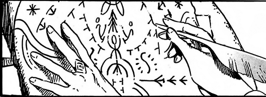

# Beldaruit's Smoke Sculpture

_Source: [https://witchhatatelier.telepedia.net/wiki/Beldaruit%27s_Smoke_Sculpture](https://witchhatatelier.telepedia.net/wiki/Beldaruit%27s_Smoke_Sculpture)_
_Category: Unknown Spells_

| Field       | Value      |
| ----------- | ---------- |
| Type        | Spell      |
| User(s)     | Witches    |
| Manga Debut | Chapter 35 |

**Beldaruit's smoke sculpture** is a [spell](/wiki/Spells 'Spells') of unknown type that creates a dragon out of smoke.

## Description

The spell is very complex, utilizing several different signs and sigils in order to form a fake dragon out of smoke, which is capable of flying through the air and roaring.

## Usage

The spell was used by [Beldaruit](/wiki/Beldaruit 'Beldaruit') during his conversation with [Coco](/wiki/Coco 'Coco') in his room. During their conversation, he drew the spell on a flat, circular, floating platform in the air, which he used to draw the seal on.

## References

1. Witch Hat Atelier Manga: Chapter 35
