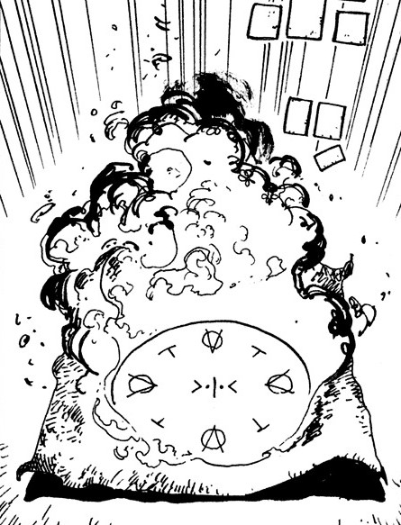

# Forbidden Flames

_Source: [https://witchhatatelier.telepedia.net/wiki/Forbidden_Flames](https://witchhatatelier.telepedia.net/wiki/Forbidden_Flames)_
_Category: Unknown Spells_

| Field       | Value          |
| ----------- | -------------- |
| Type        | Spell          |
| User(s)     | Witches , Coco |
| Manga Debut | Chapter 1      |

**Forbidden flames** is a [spell](/wiki/Spells 'Spells') of unknown type which creates a small fire.

## Description

This spell is composed of column signs, an unknown sign, and an unknown sigil. It burns like a normal fire spell, and it is unknown if it has any forbidden properties or not.

## Usage

This spell was one of the many spells [Coco](/wiki/Coco 'Coco') copied from the [picture book](/wiki/Magic_Book 'Magic Book') sold to her by [Iguin](/wiki/Iguin 'Iguin'), just like [petrification](/wiki/Petrification 'Petrification').

## References

1. Witch Hat Atelier Manga: Chapter 1 , Page 47
