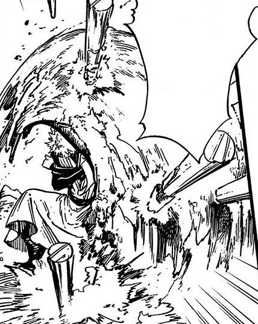

# Spike

_Source: [https://witchhatatelier.telepedia.net/wiki/Spike](https://witchhatatelier.telepedia.net/wiki/Spike)_
_Category: Unknown Spells_

| Field       | Value      |
| ----------- | ---------- |
| Type        | Spell      |
| User(s)     | Sasaran    |
| Manga Debut | Chapter 27 |

**Spike** is a [spell](/wiki/Spells 'Spells') of unknown type.

## Description

Spike generates several large spikes directly from the seal that are flung out at lethal speeds, and is a spell used for offensive purposes. The construction of the spell is entirely unknown.

## Usage

The spell was seen used by [Sasaran](/wiki/Sasaran 'Sasaran') during his fight with [Qifrey](/wiki/Qifrey 'Qifrey') within the [Serpentback Cave](/wiki/Serpentback_Cave 'Serpentback Cave'). When Sasaran fired the spell at Qifrey, Qifrey managed to block it with a wall of earth.

Qifrey deflecting the spike spell

## References

1. Witch Hat Atelier Manga: Chapter 27 , Page 16
2. Witch Hat Atelier Manga: Chapter 27 , Page 17
