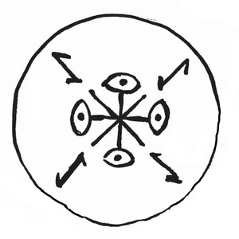

# Gathering Shadows

_Source: [https://witchhatatelier.telepedia.net/wiki/Gathering_Shadows](https://witchhatatelier.telepedia.net/wiki/Gathering_Shadows)_
_Category: Vision Spells_

| Field       | Value      |
| ----------- | ---------- |
| Type        | Spell      |
| User(s)     | Witches    |
| Manga Debut | Chapter 21 |

**Gathering Shadows** is a vision [spell](/wiki/Spells 'Spells') that makes the object it is drawn on disappear into shadow.

## Description

The spell consists of a central vision sigil, with eye sigils located on 4 of it's eight points. Bend sigils are located just off of the 4 remaining points. The spell causes the object the spell is drawn on to absorb all light that hits it, allowing the user to conceal themselves within the shadows by covering themselves with the object.

## Usage

Gathering shadows was first seen as a component of the [mirror cloak of borrowshade spell](/wiki/Mirror_Cloak_of_Borrowshade 'Mirror Cloak of Borrowshade') when [Euini](/wiki/Euini 'Euini') was inspecting the inside of the cloak during [The Sincerity of the Shield](/wiki/The_Sincerity_of_the_Shield 'The Sincerity of the Shield'). The spell was then seen in it's entirety when [Euini](/wiki/Euini 'Euini') was explaining the spell to [Agott](/wiki/Agott 'Agott'), [Richeh](/wiki/Richeh 'Richeh'), and [Alaira](/wiki/Alaira 'Alaira'). Not long after, the spell was seen as a component of the [cloak spell](/wiki/Cloak_Spell 'Cloak Spell') used in [Sasaran's](/wiki/Sasaran 'Sasaran') magic [cloak](/wiki/Sasaran%27s_Cloak?action=edit&redlink=1 "Sasaran's Cloak (page does not exist)"), which he uses almost every time he appears.

## Trivia

- Gathering shadows is included in the [mirror cloak of borrowshade](/wiki/Mirror_Cloak_of_Borrowshade 'Mirror Cloak of Borrowshade') alongside [mirror](/wiki/Mirror_Spell 'Mirror Spell').
- Gathering shadows is also included in the [Cloak Spell](/wiki/Cloak_Spell 'Cloak Spell').

## References

1. Witch Hat Atelier Manga: Chapter 21 , Page 19
2. Witch Hat Atelier Manga: Chapter 21 , Page 22
3. Witch Hat Atelier Manga: Chapter 27 , Page 22
