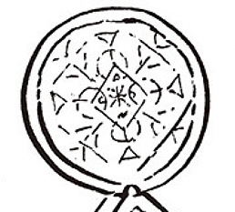
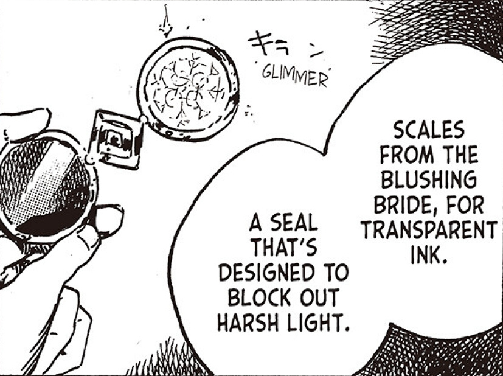

# Light-Reducing Spell

_Source: [https://witchhatatelier.telepedia.net/wiki/Light-Reducing_Spell](https://witchhatatelier.telepedia.net/wiki/Light-Reducing_Spell)_
_Category: Vision Spells_

| Field       | Value      |
| ----------- | ---------- |
| Type        | Spell      |
| User(s)     | Witches    |
| Manga Debut | Chapter 36 |

The **Light-Reducing Spell** is a vision [spell](/wiki/Spells 'Spells') that blocks out the brightest lights to protect one's eyesight.

## Description

Has a diamond sigil in the center with a few markings inside of it, and has an overlapping circle drawn over each corner. A larger diamond encases it with convergence signs drawn at each corner, and a line drawn into the inner circles. There are additional branched lines drawn between each circle that extend to the outer diamond, with two lines forming a V-shape outside of it.

## Usage

When used on glasses, the spell will block out the harshest lighting. It is used to protect one's eyesight when their vision is going.

**SPOILER WARNING**  
_This section contains spoilers for [Chapter 36](/wiki/Chapter_36 'Chapter 36')_

Light-Reducing Spell on Qifrey's glasses

Currently, [Qifrey](/wiki/Qifrey 'Qifrey') is the only known user of this spell, although Olruggio recognizes it and its purpose when discovered so it may be used by others with vision problems as well. Qifrey uses Blushing Bride ink to keep the spell transparent on his lens, and has been using the spell for the past few years.

**End of spoilers.**

## References

1. Witch Hat Atelier Manga: Chapter 36 , Page 30
2. Witch Hat Atelier Manga: Chapter 40 , Page 11
