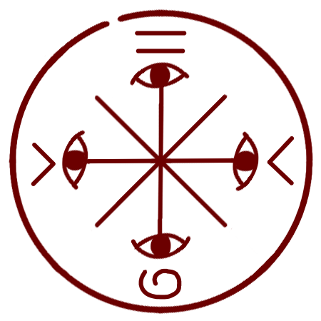

# Makeover Mask Spell

_Source: [https://witchhatatelier.telepedia.net/wiki/Makeover_Mask_Spell](https://witchhatatelier.telepedia.net/wiki/Makeover_Mask_Spell)_
_Category: Vision Spells_

| Field       | Value      |
| ----------- | ---------- |
| Type        | Spell      |
| Creator     | Olruggio   |
| User(s)     | Olruggio   |
| Manga Debut | Chapter 47 |

The **makeover mask spell** is a spell featured on the [makeover mask](/wiki/Makeover_Mask 'Makeover Mask') that makes the user's face appear clean and like their best self. Essentially, it's magic makeup.

## Description

The seal contains a central vision sigil and 4 eye signs, just like the [mirror cloak](/wiki/Mirror_Cloak_of_Borrowshade 'Mirror Cloak of Borrowshade'), with both spells being used to change the wearers appearance in some way, but that is where the similarities end. The also contains two inward facing region sigils, and two unknown signs; one resembling an equals sign, and another that looks like a spiral on the top and bottom of the seal respectively. It's not clear if the illusion effect will look the same for everyone, or if it'll change accordingly to the subject's own interpretation of beauty.

## Usage

The spell is only seen used on [Olruggio's](/wiki/Olruggio 'Olruggio') makeover mask, which he used during the [Silver Eve Festival](/wiki/Silver_Eve 'Silver Eve').

## References

1. Witch Hat Atelier Manga: Chapter 47 , Page 20
