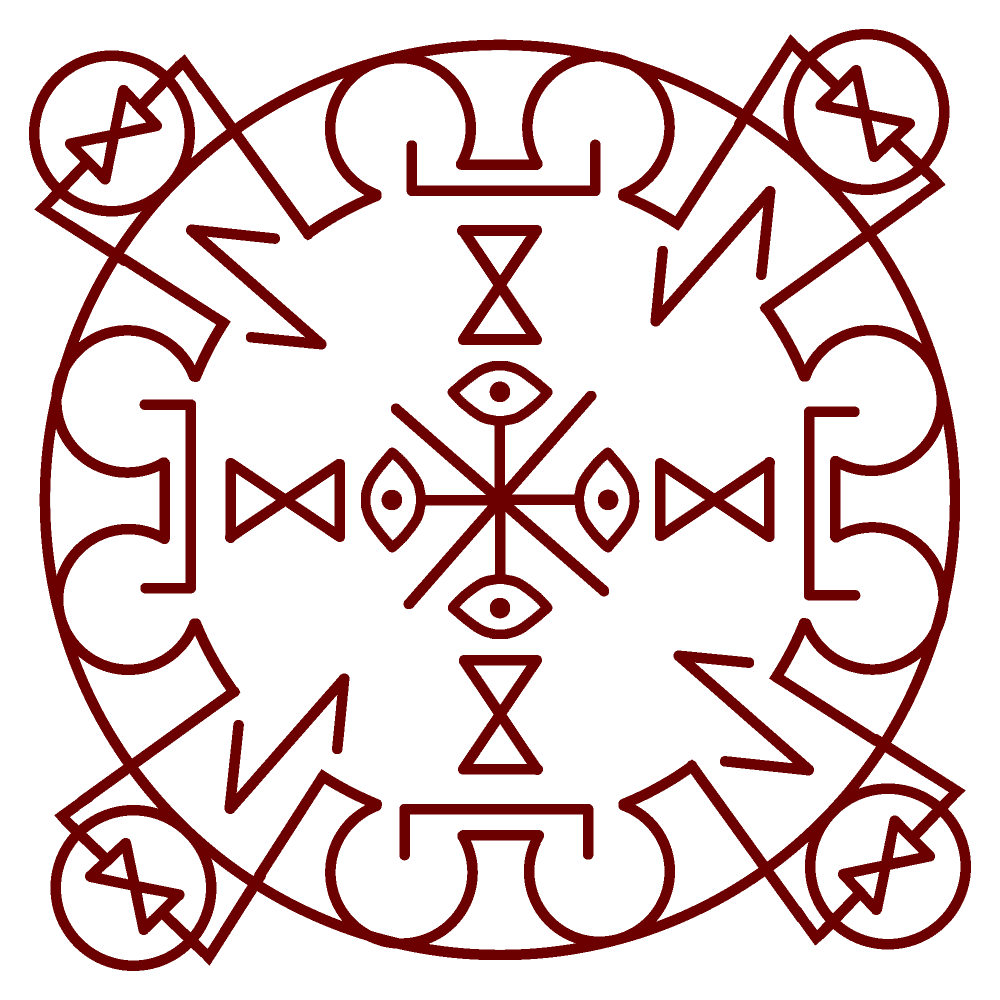
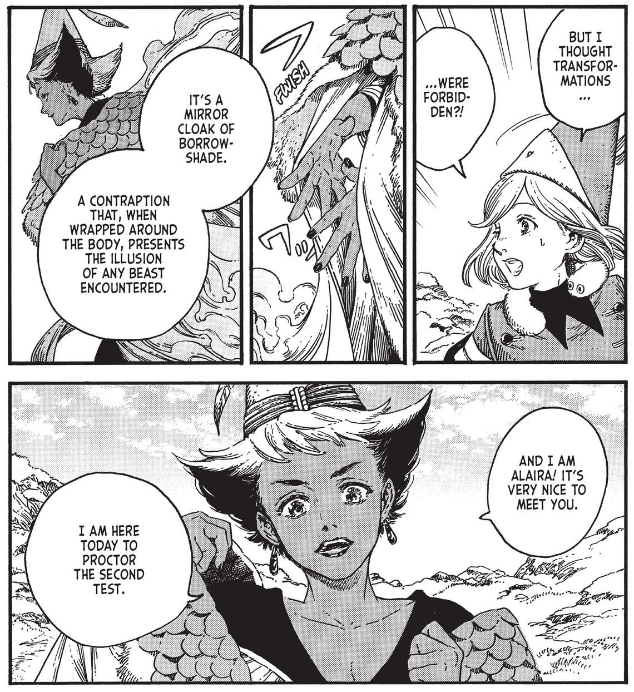

# Mirror Cloak Spell

_Source: [https://witchhatatelier.telepedia.net/wiki/Mirror_Cloak_Spell](https://witchhatatelier.telepedia.net/wiki/Mirror_Cloak_Spell)_
_Category: Vision Spells_

| Field       | Value      |
| ----------- | ---------- |
| Type        | Spell      |
| Creator     | Witches    |
| User(s)     | Witches    |
| Manga Debut | Chapter 21 |

**Mirror cloak** is a vision [spell](/wiki/Spells 'Spells') that allows the wearer to take the shape of a nearby creature.

## Description

Mirror cloaks are composed of signs of concealment, reflection, and [Gathering Shadows](/wiki/Gathering_Shadows 'Gathering Shadows'). According to [Euini](/wiki/Euini 'Euini'), the "signs of reflection combine to make the wearer vanish into shadow, then let the cloak's scales reflect back an image of whatever beast is nearby."

## Usage

Alaira explaining the use of Mirror Cloaks as she arrives to proctor.

Mirror cloaks are customarily used as part of [The Sincerity of the Shield](/wiki/The_Sincerity_of_the_Shield 'The Sincerity of the Shield') test, as it would be near impossible to lead the [myrphons](/wiki/Myrphons 'Myrphons') otherwise. It is unknown if they are widely used for other purposes otherwise.

## Trivia

- The Mirror Cloak spell contains [Gathering Shadows](/wiki/Gathering_Shadows 'Gathering Shadows') and [Mirror Spell](/wiki/Mirror_Spell 'Mirror Spell').

## References

1. Witch Hat Atelier Manga: Chapter 21 , Page 19
2. Witch Hat Atelier Manga: Chapter 21 , Page 22
3. Witch Hat Atelier Manga: Chapter 19 , Page 16
