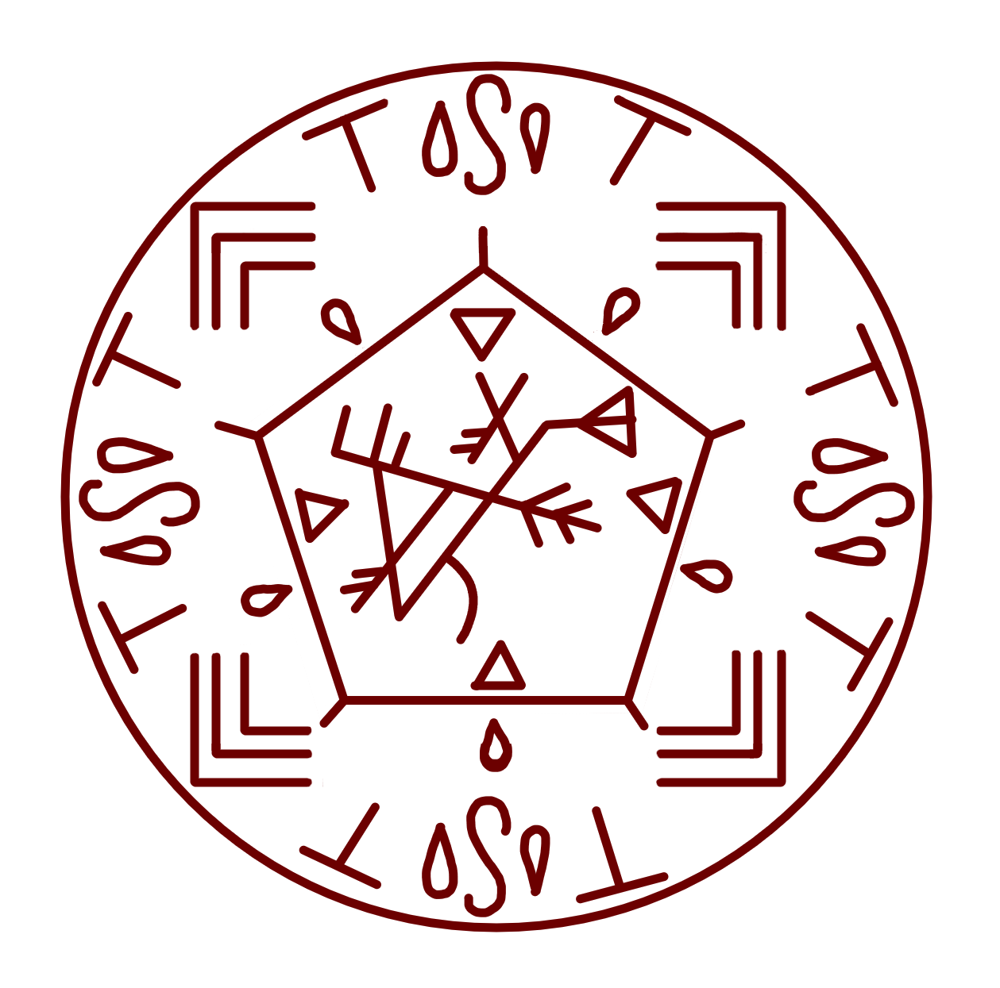
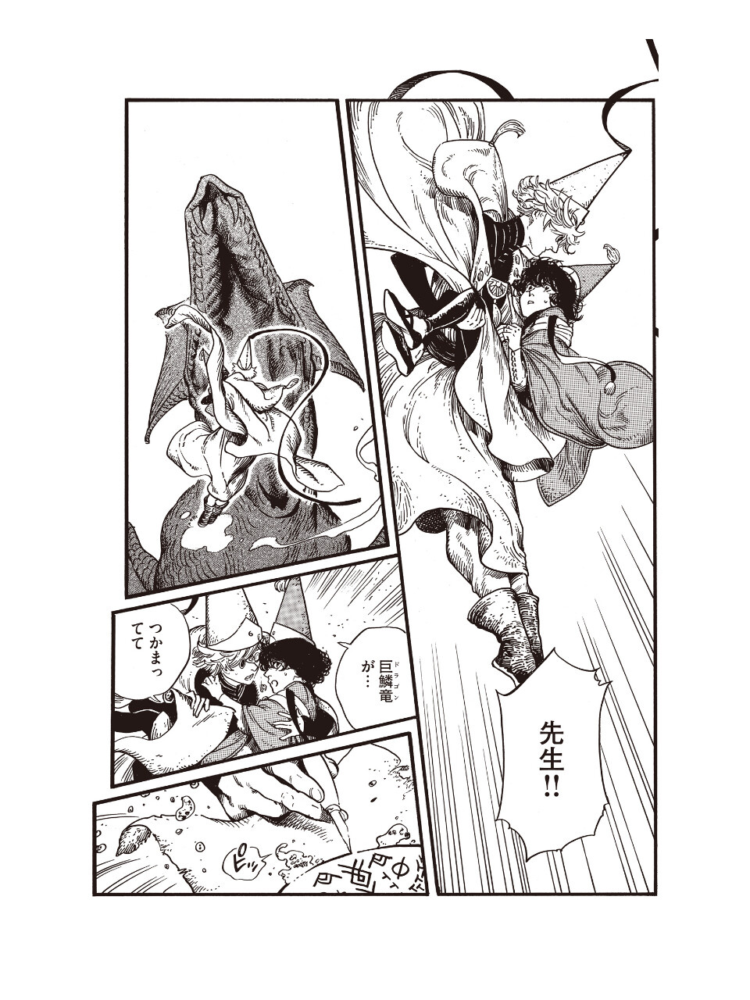

# Qifrey's Water Dragon

_Source: [https://witchhatatelier.telepedia.net/wiki/Qifrey%27s_Water_Dragon](https://witchhatatelier.telepedia.net/wiki/Qifrey%27s_Water_Dragon)_
_Category: Water Spells_

| Field       | Value     |
| ----------- | --------- |
| Type        | Spells    |
| Creator     | Qifrey    |
| User(s)     | Qifrey    |
| Manga Debut | Chapter 7 |
| Anime Debut | Episode 5 |

The **water dragon spell** uses water from nearby clouds (and likely bodies of water) to produce a giant dragon made of water, which will subsequently turn into a water lily before the spell stops working.

## Description

The center of the seal contains a dragon sigil. This allows the spell to form a giant dragon. The modified flower seal around it, which has it's arch shaped portions swapped for water droplets, likely is what's responsible for allowing the water gathered by the spell to take the shape of a water lily once the dragon dissipates. The water is gathered thanks to the convergence signs, which in the case of the spell being used near clouds, will "converge" the water in them to a point thanks to the water sigils, allowing it to be incorporated into the spell. From there, enlarge signs make the dragon bigger, and column signs dictate its direction.

## Usage

The spell is used by [Qifrey](/wiki/Qifrey 'Qifrey') to subdue the [dragon](/wiki/Dragon 'Dragon') that was attacking Coco in the [Illusory Labyrinth](/wiki/Illusory_Labyrinth 'Illusory Labyrinth').

## Image Gallery

- 

  The [Chapter 7](/wiki/Chapter_7 'Chapter 7') manga page features a version of the spell in Japanese [Volume 2](/wiki/Volume_2 'Volume 2') printings from 2022 onwards, as well as in the [Novelization](</wiki/Volume_2_(Bluebird_Novel)> 'Volume 2 (Bluebird Novel)')

## Trivia

- This spell is only ever seen at steep angles or an incomplete manner. Due to this, it was necessary to collect every instance in which it was visible and compare in order to figure out the full design.
- This spell was never shown in the English release of [Volume 2](/wiki/Volume_2 'Volume 2'), with the paper on which it was drawn instead being blank. It was, however, visible in newer editions of the Japanese version of the volume.
- In the volumes were the spell is shown, its design is completely different to the one seen in the anime. The spell, however, has been entirely changed in the anime.

## References

1. Witch Hat Atelier Manga: Chapter 7 , Page 26
2. Witch Hat Atelier Anime: Episode 5
