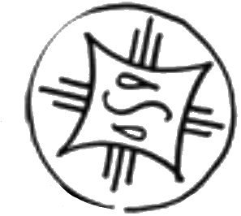

# Rainbringer Seal

_Source: [https://witchhatatelier.telepedia.net/wiki/Rainbringer_Seal](https://witchhatatelier.telepedia.net/wiki/Rainbringer_Seal)_
_Category: Water Spells_

| Field       | Value      |
| ----------- | ---------- |
| Japanese    | 雨生み     |
| Rōmaji      | ameumi     |
| Type        | Spell      |
| User(s)     | Witches    |
| Manga Debut | Chapter 28 |

**Rainbringer seal** is a water-type spell which generates rain.

## Description

The rainbringer seal consists of a central water sigil with a rain sign surrounding it. When drawn, it creates a shower of rain.

## Usage

This spell was never actually seen being used by anyone. However, it is known that this spell is one that [Qifrey's aprentices](/wiki/Qifrey%27s_Atelier "Qifrey's Atelier") had commited to memory before the events that transpired within the [Serpentback Cave](/wiki/Serpentback_Cave 'Serpentback Cave'). The rainbringer seal was seen in a mural of all the spells that the aprentices had in their arsenal when they were discussing a way to potentially turn [Euini](/wiki/Euini 'Euini') back into a human after he was afflicted with the [scalewolf curse](/wiki/Scalewolf_Curse 'Scalewolf Curse').

## References

1. Witch Hat Atelier Manga: Chapter 28 , Page 10
