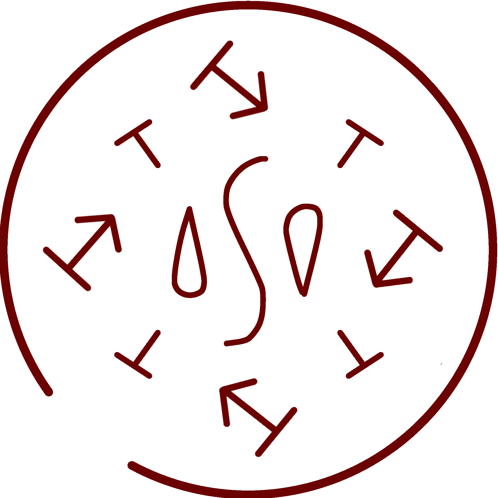

# Rising Platform of Water

_Source: [https://witchhatatelier.telepedia.net/wiki/Rising_Platform_of_Water](https://witchhatatelier.telepedia.net/wiki/Rising_Platform_of_Water)_
_Category: Water Spells_

| Field    | Value              |
| -------- | ------------------ |
| Japanese | 水の昇り台         |
| Rōmaji   | Mizu no nobori'dai |
| Type     | Spell              |
| User(s)  | Witches            |

**Rising platform of water** is a water-type spell that creates an upwards surge of water.

## Description

This spell consists of a central water sigil with horizontally facing levitation signs and outward-facing column signs surrounding it. When drawn on an object, the spell will generate a column of water that will lift said object straight up into the air.

## Usage

Rising Platform of Water was shown to be the spell utilized by [Richeh](/wiki/Richeh 'Richeh')'s old master and his apprentices in order to traverse the floating mountains of [Dadah Range](/wiki/Dadah_Range 'Dadah Range') in order to pass the [Consent of the Crown](/wiki/Consent_of_the_Crown 'Consent of the Crown'). The spell design itself was shown later in a collage of other spells the girls already knew as they strategized a way to help [Euini](/wiki/Euini 'Euini') during the [Second Pentagram Test Arc](/wiki/Second_Pentagram_Test_Arc 'Second Pentagram Test Arc').

## References

1. Witch Hat Atelier Manga: Chapter 25 , Page 16
2. Witch Hat Atelier Manga: Chapter 28 , Page 11
