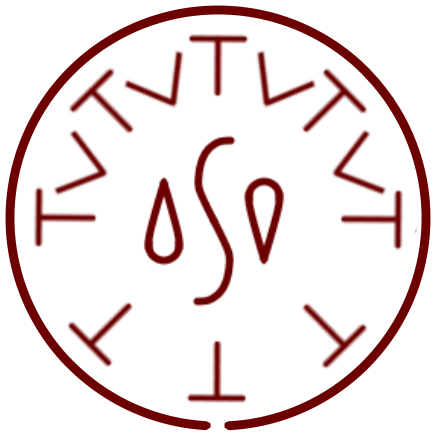

# Rising Wave

_Source: [https://witchhatatelier.telepedia.net/wiki/Rising_Wave](https://witchhatatelier.telepedia.net/wiki/Rising_Wave)_
_Category: Water Spells_

| Field       | Value      |
| ----------- | ---------- |
| Type        | Spell      |
| User(s)     | Witches    |
| Manga Debut | Chapter 27 |

**Rising wave**[*unofficial name*] is a water-type spell that creates a surge of water.

## Description

Rising wave has a central water sigil surrounded by a ring of column signs. On half of the spell, region signs are located between the column signs. This spell creates a surge of water that travels up diagonally, allowing the caster to propel themselves up into the air.

## Usage

[Qifrey](/wiki/Qifrey 'Qifrey') used this spell during his battle with [Sasaran](/wiki/Sasaran 'Sasaran') in the [Serpentback Cave](/wiki/Serpentback_Cave 'Serpentback Cave').

## References

1. Witch Hat Atelier Manga: Chapter 27 , Page 16-17
