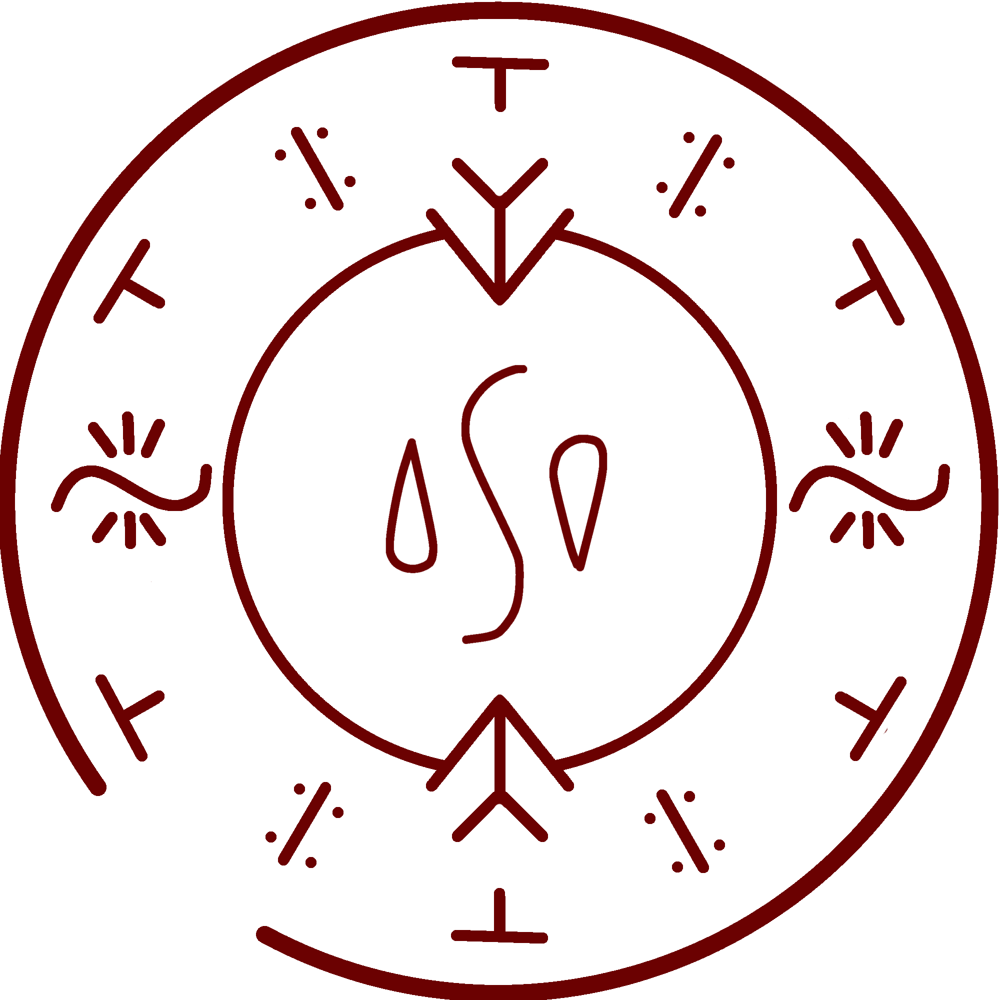

# Vapor Bubble Spell

_Source: [https://witchhatatelier.telepedia.net/wiki/Vapor_Bubble_Spell](https://witchhatatelier.telepedia.net/wiki/Vapor_Bubble_Spell)_
_Category: Water Spells_

| Field       | Value     |
| ----------- | --------- |
| Type        | Spell     |
| User(s)     | Witches   |
| Manga Debut | Chapter 2 |

The spell is inscribed upon the inner surfaces of two shallow saucers. Its purpose is to draw moisture from the surrounding air and condense it into a single, shimmering globule of fresh water.

## Description

The design consists of two concentric rings, each bearing distinct sigils and signs:

Inner Ring: At its center lies the Sigil of Water, flanked above and below by Signs of Gathering, symbolizing the pull of vapor into form.

Outer Ring: To the left and right are Sigils of Wind, channeling the currents of air. Beside each wind sigil rests a Sign of Column, stabilizing the flow, followed by Signs of Cooling, which complete the condensation process.
