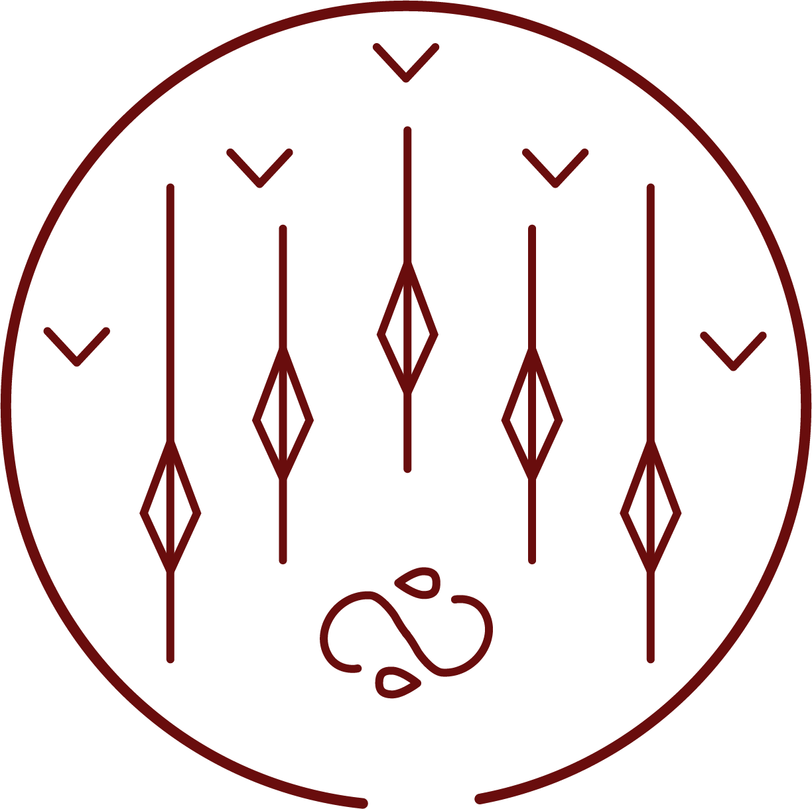

# Water Bolt

_Source: [https://witchhatatelier.telepedia.net/wiki/Water_Bolt](https://witchhatatelier.telepedia.net/wiki/Water_Bolt)_
_Category: Water Spells_

| Field       | Value            |
| ----------- | ---------------- |
| Type        | Spell            |
| User(s)     | Qifrey , Witches |
| Manga Debut | Chapter 24       |

**Water bolt**[*unofficial name*] is a water-type [spell](/wiki/Spells 'Spells') that creates water arrows.

## Description

Water bolt is a spell that consists of a water sigil near the bottom, with one horizontal row of bolt signs going through the middle of the spell, perpendicular to the water sigil, and another row of region signs running parallel to the row of bolt signs. The spell shoots bolts of water straight ahead, and is more effective when drawn big, needing to be drawn on the ground in order for there to be enough room for it to be effective.

## Usage

Water bolt was used by [Qifrey](/wiki/Qifrey 'Qifrey') during his battle with [The Ancients of Romonon](/wiki/The_Ancients_of_Romonon 'The Ancients of Romonon') in the [Serpentback Cave](/wiki/Serpentback_Cave 'Serpentback Cave'). Qifrey drew the seal using the [water pen](/wiki/Water_Pen 'Water Pen') spell.

## References

1. Witch Hat Atelier Manga: Chapter 24 , Page 9
2. Witch Hat Atelier Manga: Chapter 24 , Page 8
