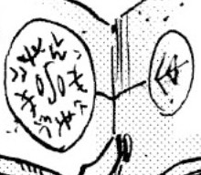

# Water Cage

_Source: [https://witchhatatelier.telepedia.net/wiki/Water_Cage](https://witchhatatelier.telepedia.net/wiki/Water_Cage)_
_Category: Water Spells_

| Field       | Value      |
| ----------- | ---------- |
| Type        | Spell      |
| Creator     | Qifrey     |
| User(s)     | Qifrey     |
| Manga Debut | Chapter 68 |

**Water Cage**[*unofficial name*] is a water-type spell which creates a spherical "cage".

## Description

This spell is composed up of two connected spells. The lesser of the two spells contains only a pull sign pointing towards the larger spell. The larger spell is comprised of region signs pointing towards crush signs, two region signs close together, and an unknown third sign. It is likely that the function of the smaller pull-spell was in order to force [Engendale](/wiki/Engendale 'Engendale') within the actual water cage easier.

## Usage

[Qifrey](/wiki/Qifrey 'Qifrey') used this spell against Engendale while protecting [Coco](/wiki/Coco 'Coco'). Because it was a water spell, all of Engendale's spells were set off at once while the ink was washed away.

## References

1. Witch Hat Atelier Manga: Chapter 68 , Page 27
2. Witch Hat Atelier Manga: Chapter 68 , Page 27-30
