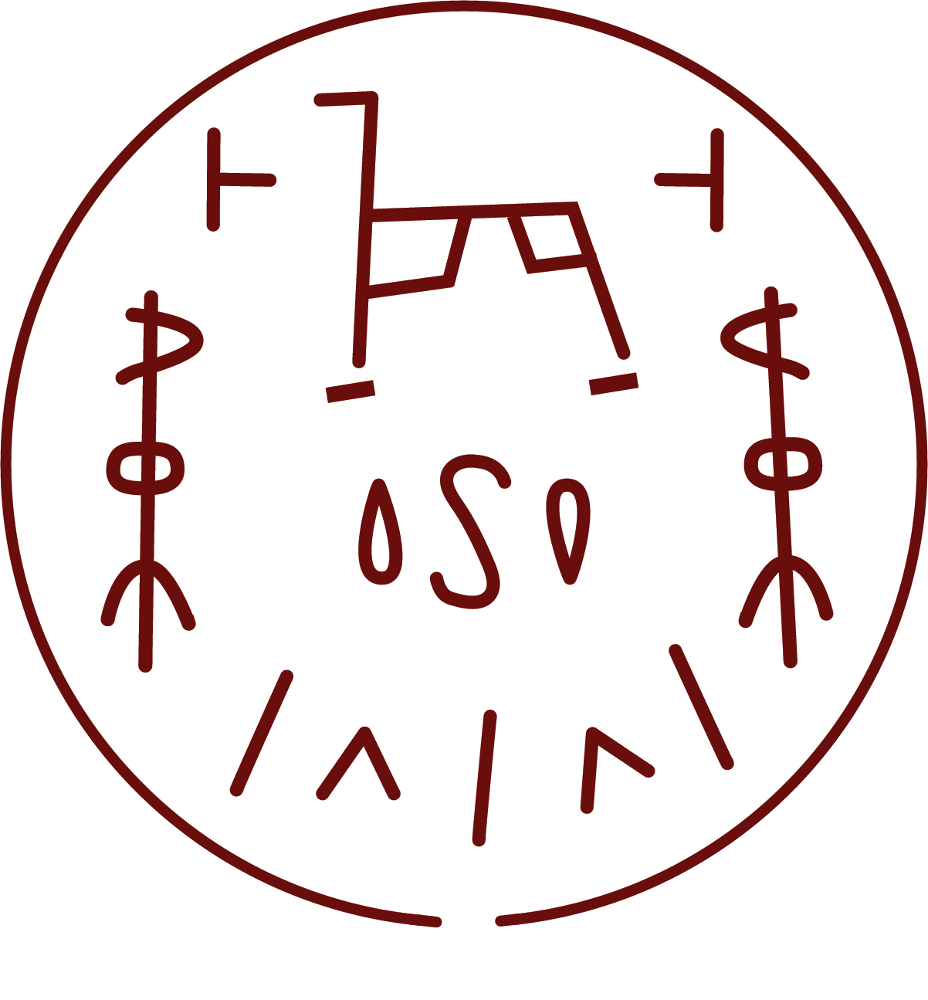

# Water Horse Spell

_Source: [https://witchhatatelier.telepedia.net/wiki/Water_Horse_Spell](https://witchhatatelier.telepedia.net/wiki/Water_Horse_Spell)_
_Category: Water Spells_

| Field       | Value            |
| ----------- | ---------------- |
| Type        | Spell            |
| User(s)     | Qifrey , Witches |
| Manga Debut | Chapter 46       |

The **Water Horse Spell**[*unofficial name*] is a water-type [spell](/wiki/Spells 'Spells') that creates a horse made from water.

## Description

The spell consists of a central water sigil, with a horse-like decorative sign located above it. An unknown sign is located to the left and right of the sigil, and an alternating collection of region and line-shaped signs are situated below the sigil. The spell creates a horse made from water, which can be used to pull a vehicle, such as in the case of the [water horse carriage](/wiki/Water_Horse_Carriage 'Water Horse Carriage').

## Usage

The spell was used by [Qifrey](/wiki/Qifrey 'Qifrey') to pull a water horse carriage which he and [his apprentices](/wiki/Qifrey%27s_Atelier "Qifrey's Atelier") used to travel to the [Silver Eve](/wiki/Silver_Eve 'Silver Eve') festival. Control of the horse's movement was done via a long pole with an open scroll at the far end (potentially with an unknown second spell on it) covering the horse's face. The water horse spell was ended by lowering that scroll to the ground.

## References

1. Witch Hat Atelier Manga: Chapter 46 , Page 7
2. Witch Hat Atelier Manga: Chapter 46 , Page 8
3. Witch Hat Atelier Manga: Chapter 46 , Page 10
