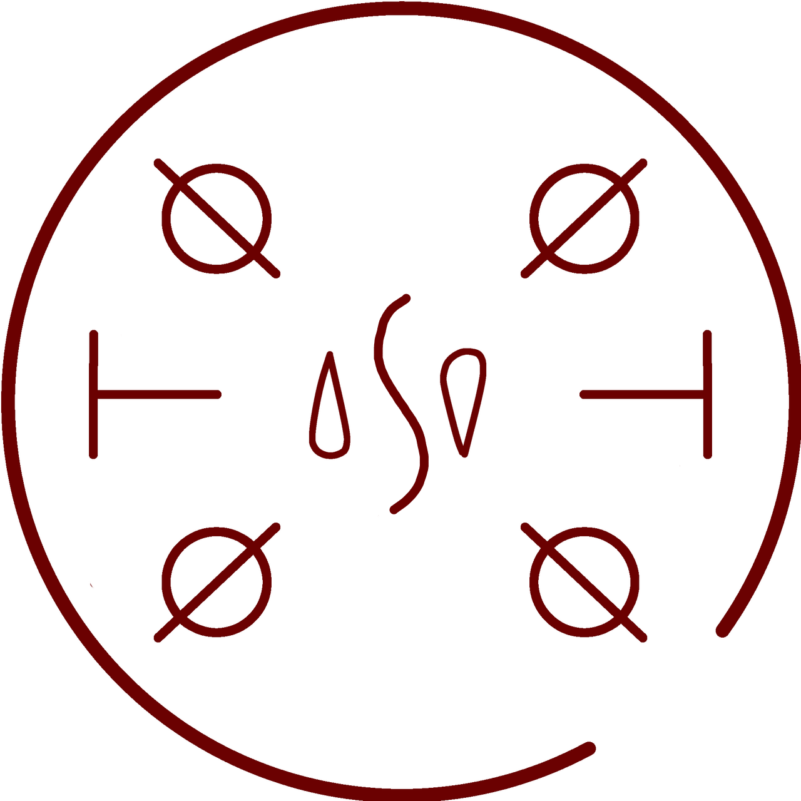

# Water Orb

_Source: [https://witchhatatelier.telepedia.net/wiki/Water_Orb](https://witchhatatelier.telepedia.net/wiki/Water_Orb)_
_Category: Water Spells_

| Field       | Value      |
| ----------- | ---------- |
| Type        | Spell      |
| Creator     | Qifrey     |
| User(s)     | Witches    |
| Manga Debut | Chapter 53 |

**Water Orb**[*unofficial name*] is water-type [spell](/wiki/Spells 'Spells') that creates an invisible spherical container for water

## Description

Water Orb is a spell that consists of a inverted central water sigil, the inverted water sigil does not change its affect that we know of. The sigil is enclosed by two [column signs](/wiki/Signs_Explained#Column 'Signs Explained') on either side, and the central sigil is enclosed by four [orb signs](/wiki/Signs_Explained#Orb 'Signs Explained') one in each corner. This spell holds water in a invisible spherical container.

## Usage

[Qifrey](/wiki/Qifrey 'Qifrey') uses this spell when talking to [Agott](/wiki/Agott 'Agott') at [Silver Eve](/wiki/Silver_Eve 'Silver Eve')

## References

1. Witch Hat Atelier Manga: Chapter 53 , Page 19
