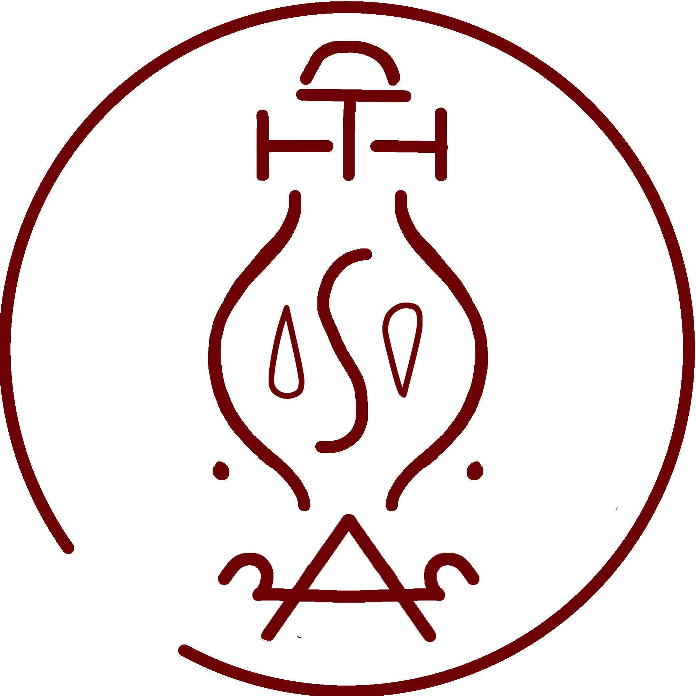

# Water Pen

_Source: [https://witchhatatelier.telepedia.net/wiki/Water_Pen](https://witchhatatelier.telepedia.net/wiki/Water_Pen)_
_Category: Water Spells_

| Field       | Value            |
| ----------- | ---------------- |
| Type        | Spell            |
| User(s)     | Qifrey , Witches |
| Manga Debut | Chapter 24       |

**Water pen** (Unofficial name) is a water-type [spell](/wiki/Spells 'Spells') that makes a dagger or pen nib-shaped glob of water.

## Description

Water pen is a spell that consists of a central water sigil with an unknown triangle-like decorative sign below, unknown signs shaped like parts of a circle's perimeter on each side, and a dispersion sign with 2 column signs protruding from the sides at the top of the seal. It creates a dagger or pen nib-shaped glob of water, which hovers below the seal at an angle. [conjuring ink](/wiki/Conjuring_Ink 'Conjuring Ink') can be poured into the dagger, which will saturate the water with ink. This allows the user to utilize the Water Pen to draw very large seals on practically any surface. It is best utilized by drawing the seal in a [palm quire](/wiki/Palm_Quire 'Palm Quire') and holding it within the hand to control.

## Usage

Water pen was used by [Qifrey](/wiki/Qifrey 'Qifrey') during his battle with the [gilded people of Romonon](/wiki/The_Ancients_of_Romonon 'The Ancients of Romonon') in [Serpentback Cave](/wiki/Serpentback_Cave 'Serpentback Cave'). Qifrey used it to draw one unidentified spell and one [water bolt](/wiki/Water_Bolt 'Water Bolt') spell.

## References

1. Witch Hat Atelier Manga: Chapter 24 , Page 3
2. Witch Hat Atelier Manga: Chapter 24 , Page 4-5
3. Witch Hat Atelier Manga: Chapter 24 , Page 8-9
