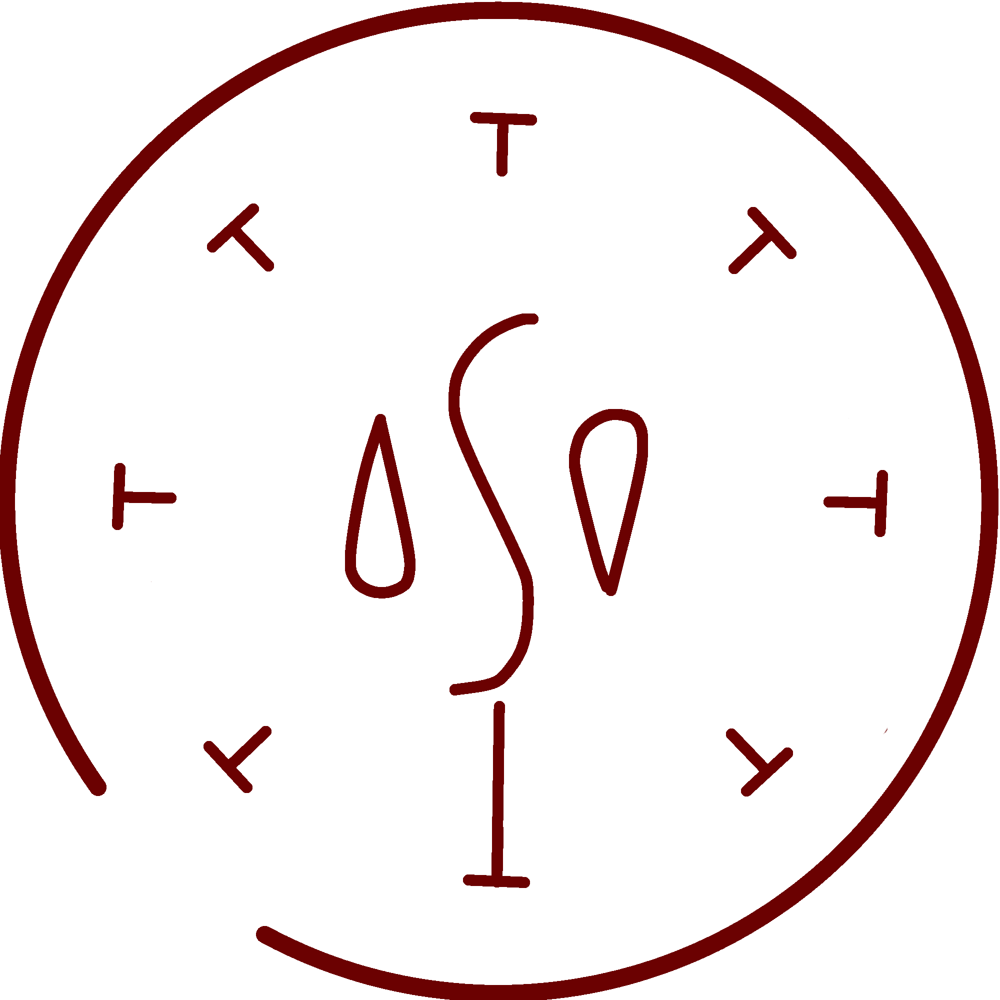

# Watershot Seal

_Source: [https://witchhatatelier.telepedia.net/wiki/Watershot_Seal](https://witchhatatelier.telepedia.net/wiki/Watershot_Seal)_
_Category: Water Spells_

| Field       | Value     |
| ----------- | --------- |
| Type        | Spell     |
| User(s)     | Witches   |
| Manga Debut | Chapter 3 |

**Watershot seal**[*unofficial name*] is a water-type [spell](/wiki/Spells 'Spells') that creates a stream of water.

## Description

Watershot seal is a spell that consists of a central water sigil surrounded by column signs. Assuming all the signs are of equivalent length, it will shoot water straight up from the seal.

## Usage

Watershot seal was the first spell which [Coco](/wiki/Coco 'Coco') learned while at [Qifrey's Atelier](/wiki/Qifrey%27s_Atelier "Qifrey's Atelier"). When Coco completed the seal, it misfired and hit [Agott](/wiki/Agott 'Agott') in the face, soaking her and the page she was drawing on. To Coco's surprise, Agott wasn't mad, and she walked towards Coco and explained that the reason the spell shot off to the side rather than straight up was because Coco had drawn one of the column signs longer than the others, causing the spell to be unbalanced and shoot in the direction of that longer column sign.. Coco [later used this same concept](/wiki/Chapter_4 'Chapter 4') during the [Consent of the Crown](/wiki/Consent_of_the_Crown 'Consent of the Crown') to make the [Skysoaring Seal](/wiki/Skysoaring_Seal 'Skysoaring Seal'), which she used to pass the test.

## References

1. Witch Hat Atelier Manga: Chapter 3 , Page 16
2. Witch Hat Atelier Manga: Chapter 3 , Page 13
3. Witch Hat Atelier Manga: Chapter 4 , Page 21
