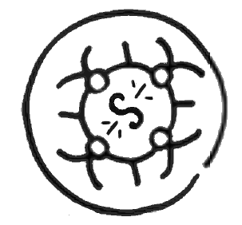
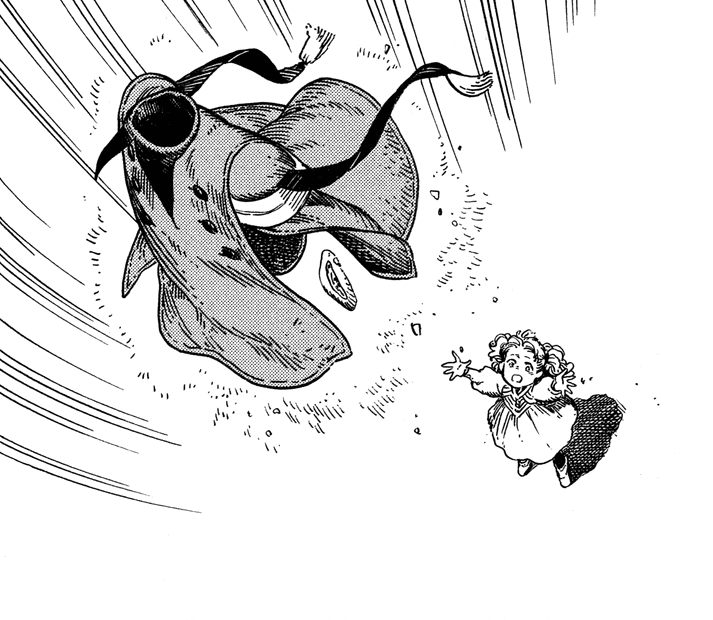

# Flying Puppet of Diversion

_Source: [https://witchhatatelier.telepedia.net/wiki/Flying_Puppet_of_Diversion](https://witchhatatelier.telepedia.net/wiki/Flying_Puppet_of_Diversion)_
_Category: Wind Spells_

| Field       | Value                 |
| ----------- | --------------------- |
| Japanese    | 空飛ぶ囮人形          |
| Rōmaji      | soratobu otori ningyō |
| Type        | Spell                 |
| User(s)     | Witches               |
| Manga Debut | Chapter 6             |

**Flying puppet of diversion** is a wind-type [spell](/wiki/Spells 'Spells') that will cause nearby objects to dart through the sky.

## Description

Flying puppet of diversion contains a central wind sigil surrounded by the ring-like dancing puppet sign. When the seal is completed, it will cause any objects near it to dart into the sky and move around erratically, with enough strength to even carry some objects up into the sky with it.

## Usage

Flying puppet of diversion was used by [Tetia](/wiki/Tetia 'Tetia') to distract the [dragon](/wiki/Dragon 'Dragon') that was chasing her and the other [aprentices](/wiki/Qifrey%27s_Atelier "Qifrey's Atelier") while they were inside the [Underground Labyrinth](/wiki/Underground_Labyrinth?action=edit&redlink=1 'Underground Labyrinth (page does not exist)'). Tetia used the spell on her cloak and hat so it would appear large enough to be noticeable to the dragon.

Tetia using the the spell on her hat and robe.

## References

1. Witch Hat Atelier Manga: Chapter 6 , Page 8
2. Witch Hat Atelier Manga: Chapter 6 , Page 9
