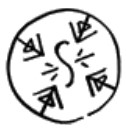

# Grasping Wind

_Source: [https://witchhatatelier.telepedia.net/wiki/Grasping_Wind](https://witchhatatelier.telepedia.net/wiki/Grasping_Wind)_
_Category: Wind Spells_

| Field       | Value          |
| ----------- | -------------- |
| Japanese    | 風寄せの手     |
| Rōmaji      | kazeyose no te |
| Type        | Spell          |
| User(s)     | Witches        |
| Manga Debut | Chapter 14     |

**Grasping wind** is a wind-type [spell](/wiki/Spells 'Spells') that causes a strong wind current towards the seal.

## Description

Grasping wind contains a wind sigil surrounded by inward facing pulling signs. When completed, this spell will cause a wind current to go towards it, having enough force to pull some lighter objects towards it. Additionally, if the pulling signs are slanted, the air will twist, creating a vortex that can twist objects as they are pulled towards the spell.

## Usage

The spell was first seen being used by [Coco](/wiki/Coco 'Coco') when she was attempting to use the spell to pluck a [mountain apple](/wiki/Mountain_Apple 'Mountain Apple') from a small tree, but she drew the seal too large and uprooted the entire tree. [Tetia](/wiki/Tetia 'Tetia') suggested drawing the signs at an angle to create a small vortex and pluck out the apples more easily. [Agott](/wiki/Agott 'Agott') then used the same spell, but managed to execute it perfectly, retrieving the fruit while leaving the tree unharmed.

During the events of [The Sincerity of the Shield](/wiki/The_Sincerity_of_the_Shield 'The Sincerity of the Shield') test, [Agott](/wiki/Agott 'Agott') used the spell to capture a [myrphon](/wiki/Myrphon 'Myrphon') who was attempting to run off, and Coco managed to successfully use this spell to take a magic necklace from the hands of [Iguin](/wiki/Iguin 'Iguin').

## References

1. Witch Hat Atelier Manga: Chapter 14 , Page 3
2. Witch Hat Atelier Manga: Chapter 14 , Page 2
3. Witch Hat Atelier Manga: Chapter 14 , Page 4-5
4. Witch Hat Atelier Manga: Chapter 20
