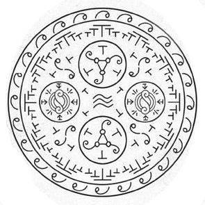

# Pegasus Carriage Spell

_Source: [https://witchhatatelier.telepedia.net/wiki/Pegasus_Carriage_Spell](https://witchhatatelier.telepedia.net/wiki/Pegasus_Carriage_Spell)_
_Category: Wind Spells_

| Field       | Value            |
| ----------- | ---------------- |
| Japanese    | 羽根馬車の陣     |
| Rōmaji      | hanebasha no jin |
| Type        | Spell            |
| User(s)     | Witches          |
| Manga Debut | Chapter 1        |

The **pegasus carriage spell** is a [spell](/wiki/Spells 'Spells') of unknown type that allows the [pegasus carriage](/wiki/Pegasus_Carriage 'Pegasus Carriage') to fly and remain stable.

## Description

The spell contains of two exterior rings and four interior, smaller subspells.
The outer ring is made up of signs of wind. At the center of the inner ring is a sign of stability and level planes, which helps to keep the carriage upright. It is surrounded by four inward-facing column signs. Further out, between the sub-spells, are arrangements of wind signs and column signs, with the column signs all point clockwise, presumably adding a rotational aspect to the spell. The outermost section of the inner ring is packed with a large number of column signs. Two of the subspells contain wind underfoot sigils paired with levitation signs and signs of aeriforms defined. The other two sub-spells contain whorling wind sigils and column signs. It is difficult to ascertain how this seal functions, as it contains many things which aren't seen anywhere else, specifically the sigil of whorling wind and the signs of wind, which have uncertain functions.

The spell is the main component of the pegasus carriage, which uses the spell to stay steady and upright while it is being pulled.

## Usage

The spell was first seen when a pair of noble girls visited [Coco's Village](/wiki/Coco%27s_Village "Coco's Village") to browse the wears for sale at the shop of [Coco's Mother](/wiki/Coco%27s_Mother "Coco's Mother"). They came in a Pegasus carriage, which was broken by two village boys. After this, [Qifrey](/wiki/Qifrey 'Qifrey') repaired the seal, during which it was seen by [Coco](/wiki/Coco 'Coco'), leading to her realizing that magic is drawn.

## References

1. Witch Hat Atelier Manga: Chapter 1
