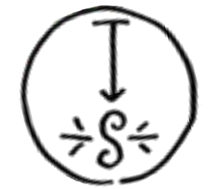
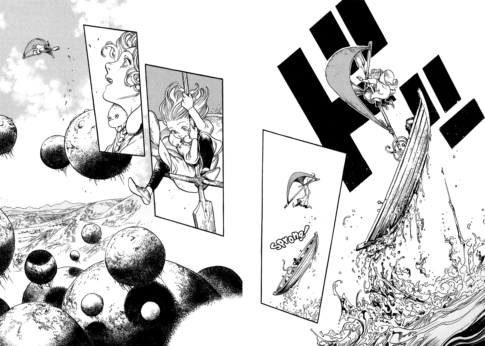

# Skysoaring Seal

_Source: [https://witchhatatelier.telepedia.net/wiki/Skysoaring_Seal](https://witchhatatelier.telepedia.net/wiki/Skysoaring_Seal)_
_Category: Wind Spells_

| Field       | Value          |
| ----------- | -------------- |
| Japanese    | 空すっ飛び     |
| Rōmaji      | sorasuttobi    |
| Type        | Spell          |
| Creator     | Coco           |
| User(s)     | Coco , Witches |
| Manga Debut | Chapter 4      |

**Skysoaring seal** is a wind-type [spell](/wiki/Spells 'Spells') that can allow things to fly when drawn large enough.

## Description

The skysoaring seal contains a wind sigil located at the bottom of the seal with a levitation sign spanning from just above the sigil to the opposite side of the seal. The spell produces thrust in the direction of it's sign, and when drawn on something large such as a sail , can even allow that object to fly.

## Usage

[Coco](/wiki/Coco 'Coco'), who was undergoing a test called the [Consent of the Crown](/wiki/Consent_of_the_Crown 'Consent of the Crown'), needed to acquire a [Diadem Herb](/wiki/Diadem_Herb 'Diadem Herb') in order to pass the test and become an apprentice witch. The herb only grew on the floating spheres of [Dadah Range](/wiki/Dadah_Range 'Dadah Range'), meaning that in order to reach the plant, Coco would need some way to fly. However, shortly after arriving, Coco fell into some water, which washed away the [seal](/wiki/Sylph_Shoes_Seal 'Sylph Shoes Seal') on the [sylph shoes](/wiki/Sylph_Shoes 'Sylph Shoes') [Agott](/wiki/Agott 'Agott') had lent her. This ruined their magic, and left Coco without a means to fly up to the herb. Later, after finding a boat and reflecting on her situation, Coco came up with the idea for the skysoaring seal, keeping in mind the lesson she learned regarding the [watershot seal](/wiki/Watershot_Seal 'Watershot Seal') from Agott the day prior. Using a [pigment stone](/wiki/Pigment_Stone 'Pigment Stone'), Coco drew the glyph on her cloak and tied the cloak to the oars from the boat, creating a flying [contraption](/wiki/Contraption 'Contraption') reminiscent of a hang glider. She used her invention to fly up to one of the diadem herbs and grabbed it, allowing her to pass the test and become an apprentice witch.

Coco using the skysoaring seal to fly into the air.

## References

1. Witch Hat Atelier Manga: Chapter 4 , Page 22-23
2. Witch Hat Atelier Manga: Chapter 3 , Page 27
3. Witch Hat Atelier Manga: Chapter 4 , Page 6
4. Witch Hat Atelier Manga: Chapter 3 , Page 16
