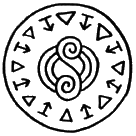

# Sylph Shoes Seal

_Source: [https://witchhatatelier.telepedia.net/wiki/Sylph_Shoes_Seal](https://witchhatatelier.telepedia.net/wiki/Sylph_Shoes_Seal)_
_Category: Wind Spells_

| Field       | Value     |
| ----------- | --------- |
| Japanese    | 飛靴      |
| Rōmaji      | tobigutsu |
| Type        | Spell     |
| User(s)     | Witches   |
| Manga Debut | Chapter 1 |

The **sylph shoes seal** is a wind-type [spell](/wiki/Spells 'Spells') that allows the user of items using it to fly.

## Description

The sylph shoes seal contains a central wind underfoot sigil (a variant of the wind sigil) surrounded by an alternating pattern of convergence and levitation signs. So far, it has only been seen on [sylph shoes](/wiki/Sylph_Shoes 'Sylph Shoes') -- [contraptions](/wiki/Contraption 'Contraption') which allow the user to float above the ground and fly whenever the two shoes are touched together. The seal is bisected, one half on each sole, and when the shoes touch together the seal completes and activates, allowing the user to fly.

## Usage

So far, every appearance of the sylph shoes seal has coincided with an appearance of the sylph shoes themselves, as they are the spell that allows the shoes to function. They have been seen used by many Pointed Cap Witches, including [Qifrey](/wiki/Qifrey 'Qifrey'), [Agott](/wiki/Agott 'Agott'), [Coco](/wiki/Coco 'Coco'), and the [Knights Moralis](/wiki/Knights_Moralis 'Knights Moralis').
